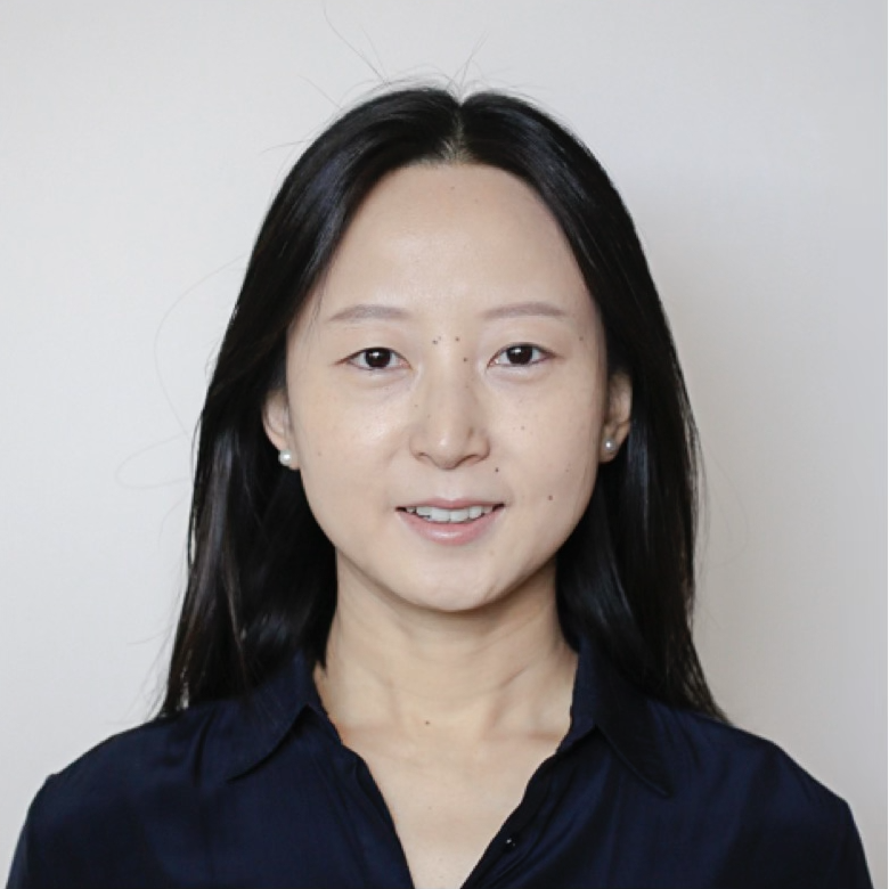

weight: 3
uid: 5a94cc93
---

# People

:::grid 2 | 1:2

:::
**Yi Yin**

Prior to NYU, Yi was a research scientist at the California Institute of Technology (Caltech). She has also held postdoctoral positions at the Jet Propulsion Laboratory (JPL) and Le Laboratoire des Sciences du Climat et de l'Environnement (LSCE). She currently serves on the Steering Committee for Foundations of Scientific Inquiry at NYU Arts and Sciences. [CV](./assets/cv_yyin_2023.pdf)
:::

:::
**Siwan**

A Cat. The best cat! He likes his servant, Prof. Yi, very much. And mice and birds and coconuts. His CV is his face.
:::

:::
**Duoduo**

A boy. The best boy! He likes his mom, Prof. Yi, very much. And trains and snow and lollipops! He doesn't know what a CV is.
:::
