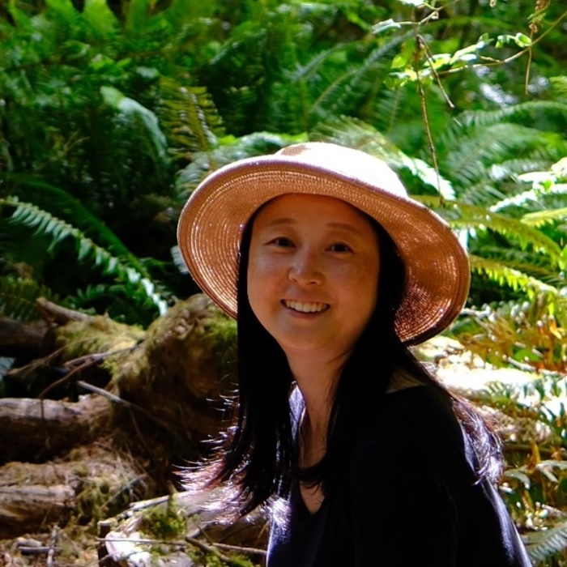
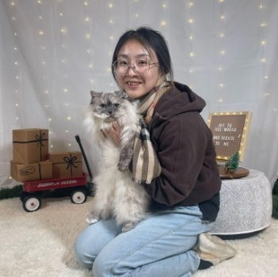
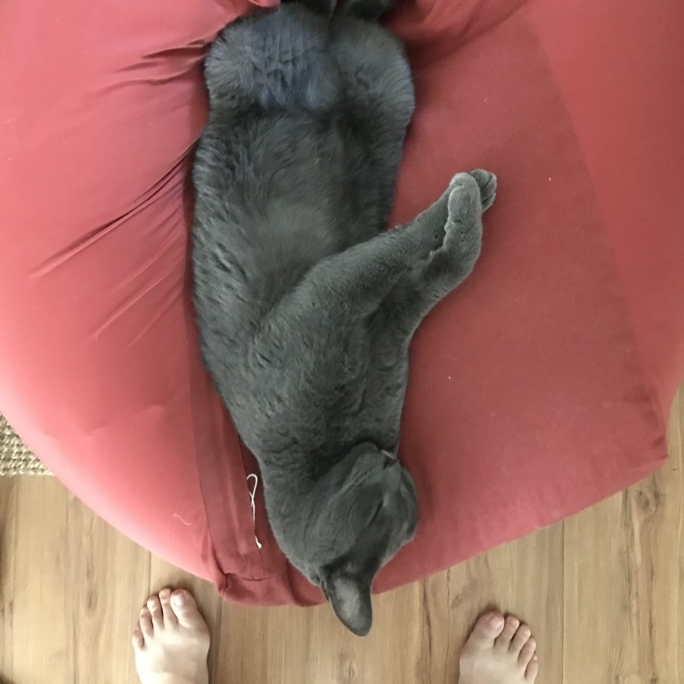
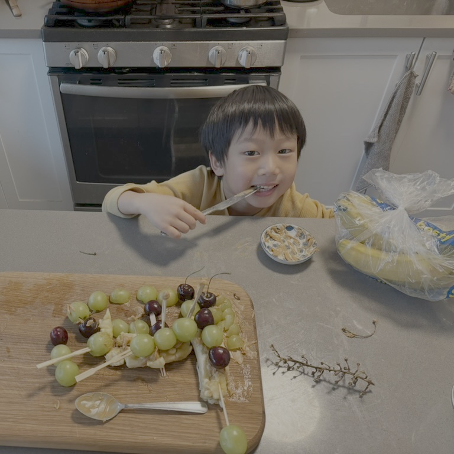

weight: 3
uid: 5a94cc93
---

# People

:::grid 2 | 2:2

:::
**Yi Yin**
| Principal Investigator; Associate Professor of Environmental Studies

Yi is an ecologist and atmospheric scientist curious about how climate change impacts ecosystems and communities, with a focus on extreme events such as heatwaves, droughts, and wildfires. She combines satellite data, ground observations, and inverse modeling to quantify greenhouse gas emissions and untangle the interactions between land, atmosphere, and people—work that ultimately informs pathways toward more resilient and equitable futures. Before joining NYU, Yi spent time as a research scientist at Caltech, and did postdocs at NASA JPL and LSCE in France (where she got bonus points for traveling around Europe). She received her PhD from Peking University in China. Outside work, Yi loves hiking, playing music with her family, and reading, either to her two kids or quietly by herself.

 [CV](./assets/cv_yyin_2023.pdf)
:::

## Postdoctoral Researchers

:::grid 2 | 1:2

:::
**Xinlei Liu**
| Postdoctoral Researcher

Xinlei is an environmental researcher focusing on the emissions and associated impact of air pollutants from wildfires and solid fuel combustion. She combines field/satellite observations and statistical/modeling approaches to address current research questions. She received her PhD from Nankai University in China, which laid a foundation in data collection through wet lab experiment design and high-precision instrumentation. During her postdoctoral experience at Peking University and a visiting period at UCLA, she expanded her expertise to include field experiments, surveys, and systematic reviews. She is particularly interested in leveraging power law distributions to uncover patterns in complex wildfire behaviors, and using the Earth System Foundation Model to decode the relationships between extreme wildfires and climate/environmental factors, in order to make these complex events more predictable and manageable. In her spare time, she loves hiking, swimming, playing badminton, and sometimes just stays home to binge-watch TVs or curl up with a book.
:::
:::grid 2 | 1:2

:::
**Qingyu Wang**
Postdoc Associate

I am a researcher focused on the carbon cycle and atmospheric science, trying to understand where greenhouse gases come from, how they move through the atmosphere, and what that means for our future climate. I earned my PhD from the University of Oklahoma, studying how boundary-layer meteorology shapes greenhouse gas transport and source attribution. Now I am a postdoctoral researcher at New York University, where I look at these processes on larger spatial and temporal scales and study how greenhouse gases interact with agricultural systems and human activities. I work with observations from the ground, mobile platforms, and satellites, alongside numerical models, to connect data with physical mechanisms. Outside of research, I enjoy spending time with my family, walking through the city to feel the air and wind, and complaining when the weather forecast gets it wrong. I also live with cats who have no interest in the carbon cycle, but an impressive talent for lying down on my keyboard at exactly the wrong moment.
:::
## Research Assistants

:::grid 2 | 1:2

:::
**Shangyi Guo**
Research Assistant

Shangyi Guo is a second-year M.S. student at NYU CUSP, working at the intersection of urban data science, complex systems, and AI. His research combines large-scale data engineering with statistical modeling to understand how environmental structures shape spatial inequality and collective human behavior at different scales. He builds scalable pipelines integrating environmental, socioeconomic, human mobility, and sensor datasets, develops models and frameworks to quantify heterogeneous treatment effects, structural dependencies, and system resilience across space and time. Outside research, he enjoys exploring nature, playing chess and guitar.
:::
:::grid 2 | 1:2
**Hoon Cho**
Research Assistant

Hoon is a second-year M.S. Computer Science student at New York University. His work largely lies in machine learning and its applications. He is particularly interested in understanding how models form and justify their decisions, why they fail, and how these failures reveal underlying patterns in the data. Outside research, he enjoys playing the piano and playing squash.
:::

## Undergraduate Research Assistant

:::grid 2 | 1:2

:::
**Elinor Adams**
Undergraduate Research Assistant

Elinor is an undergraduate student at Gallatin studying Environmental Justice and Philosophy. She is interested in understanding how humans situate themselves in and relate to the environment through the study of earth systems science and the humanities. Her research interests include the impacts of urban forestry on urban heat equity in New York City and the function of community gardens as places of activism and community building. Outside of research, she enjoys creative writing, backpacking, and cooking for her loved ones.
:::

## Honorary Members

:::grid 2 | 1:2

:::
**Siwan**

A Cat. The best cat! He likes his servant, Prof. Yi, very much. And mice and birds and coconuts. His CV is his face.
:::

:::
**Duoduo**

A boy. The best boy! He likes his mom, Prof. Yi, very much. And trains and snow and lollipops! He doesn't know what a CV is.
:::
